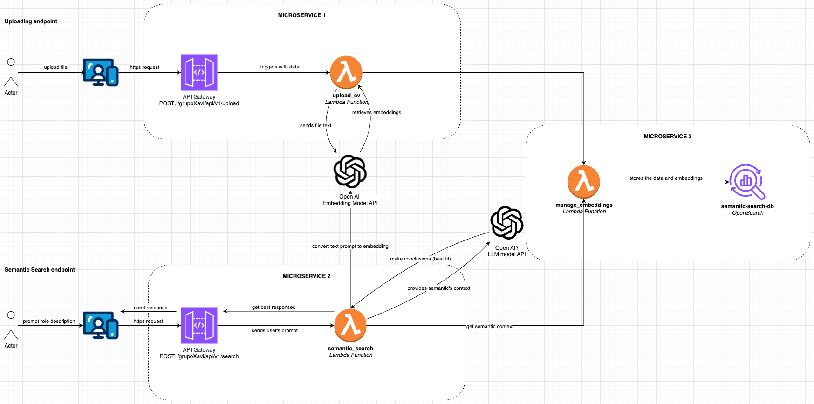

# 🚀 Busqueda Semántica de Candidatos

Este proyecto implementa un sistema de búsqueda semántica basado en embeddings generados con OpenAI y almacenados en OpenSearch. Permite la **extracción de texto desde archivos PDF**, **generación de embeddings**, y **búsqueda semántica de candidatos** con base en descripciones de roles.

## 📌 Arquitectura




La solución consta de tres microservicios:

1. **Microservicio 1 (Upload)**
   - API Gateway expone el endpoint `/upload` para recibir archivos PDF.
   - `upload_cv` Lambda extrae el texto del PDF y lo envía a `manage_embeddings`.
   - OpenAI genera embeddings del texto extraído.

2. **Microservicio 2 (Semantic Search)**
   - API Gateway expone el endpoint `/search` para recibir búsquedas.
   - `semantic_search` Lambda genera embeddings del prompt y consulta OpenSearch.
   - OpenAI LLM API puede utilizarse para refinar la búsqueda.

3. **Microservicio 3 (Storage - OpenSearch)**
   - `manage_embeddings` almacena los embeddings y el texto en `semantic-search-db` (OpenSearch).
   - `semantic_search` recupera y filtra los candidatos más relevantes.

---

## 🛠️ Despliegue de la Infraestructura

### **1️⃣ Prerrequisitos**
- **Terraform** instalado en `infra/`
- **AWS CLI** configurado con credenciales válidas
- **Node.js** y un servidor local para la UI (opcional)

### **2️⃣ Desplegar Infraestructura con Terraform**
Ejecuta los siguientes comandos en la raíz del proyecto:

```sh
cd infra
terraform init
terraform apply -auto-approve
```
